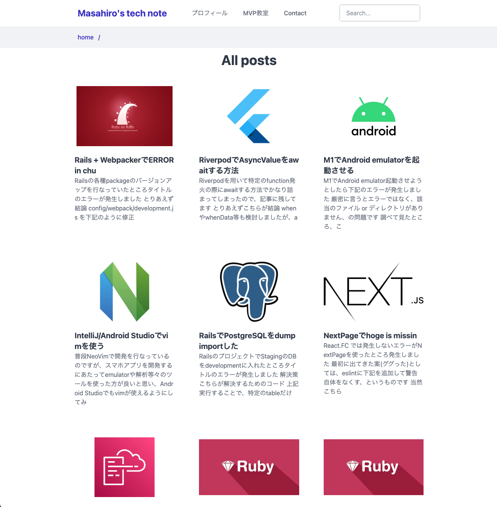

# Next.js SSG × WordPress JSON API = Cool blog🚀

## About

This is a template for displaying WordPress JSON API articles in Next.js.
It generates static files with SSG, so you can easily build a very fast and secure blog.

url: [https://masahiro.me/](https://masahiro.me/)




### Step 1. Prepare your WordPress site

First, you need a WordPress site.

### Step 2. Set up environment variables
Set your site domain and WordPress JSON API url to env section in `docker-compose.yml`.

```dockerfile
version: "3.9"
services:
  web:
    build: .
    command: tail -f /dev/null
    ports:
      - 3000:3000
    environment:
      # Set your WordPress API url
      WORDPRESS_API_URL: 'https://mokubo.website/wp-json/wp/v2'
      # Set your domain.
      DOMAIN: 'masahiro.me'
    volumes:
      - ./:/app
      - /app/node_modules
      - /app/build
```

## How to run
```bash
docker compose build
docker compose up -d
docker compose web yarn dev
```

## Lint
```
docker compose web yarn lint:fix
```

## Deploy your own
Once you have access to [the environment variables you'll need](#step-3-set-up-environment-variables), deploy the example using [Vercel](https://vercel.com?utm_source=github&utm_medium=readme&utm_campaign=next-example):

[](https://vercel.com/new/git/external?repository-url=https://github.com/masahiro04/nextjs_wordpress&env=WORDPRESS_API_URL&envDescription=Required%20to%20connect%20the%20app%20with%20WordPress&envLink=https://vercel.link/cms-wordpress-env)
